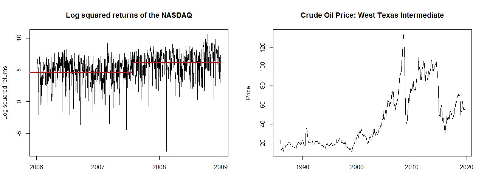

# Summary

For modeling and forecasting time series it is essential to know whether the series are stationary or non-stationary since many commonly applied statistical methods (such as OLS) are invalid under non-stationarity. Two features that cause a time series to be non-stationary are considered here. On the one hand a time series can be subject to a change in mean, i.e. the expected value of the series changes over time. On the other hand a time series can be subject to a break in the autocovariance often refered to as a change in persistence, i.e. the dependence structure of the series changes over time. Potential examples for both a change in mean and a change in persistence can be found in Figure 1. 

The left plot shows the monthly price of crude oil between 1986 and 2019. It can be seen that the series is more variable in the second part from year 2000 onwards. This might be caused by a change in the autocovariance structure of the series. The right plot presents the daily log squared returns of the NASDAQ index between 2006 and 2009. It can be seen that in the second part of the series the mean of the log squared return seems to be larger than in the first part of the series. This is evidence for a change in mean, which is likely to be caused by the financial crisis started in August 2007. 

The `memochange` package is an R [@RCoreTeam] package that identifies such changes in mean and persistence. This helps to avoid model misspecification and improves forecasts of the time series. Concerning change in persistence it implements the tests and breakpoint estimators by @leybourne2003tests, @busetti2004tests, @leybourne2004tests, @harvey2006modified, @leybourne2007cusum,  @sibbertsen2009testing, and @martins2014testing. Concerning change in mean it implements the tests by @horvath1997effect, @wang2008change, @shao2011simple, @dehling2013non, @iacone2014fixed, @betken2016testing, @wenger2018simple, and @wenger2019fixed. 

A related package is the `strucchange` package [@strucchange], which also identifies changes in mean. However, the procedures implemented in the `memochange` package allow for valid inference in a more general setting. More detailed information can be found in the vignettes of the `memochange` package. Procedures that are able to identify a change in persistence are not implemented in any package so far to the best of our knowledge.

Besides the series featured in Figure 1, there is a wide range of macroeconomic and financial time series where the implemented tests can respectively should be applied. This includes beta, inflation rates, trading volume, and volatilities, among others. Recent scholarly publications that apply the approaches that the `memochange` package implements are, for example, @sibbertsen2014testing, @baillie2019long, and @wenger2019fixed.

# Acknowledgements

Financial support of the Deutsche Forschungsgemeinschaft (DFG) is gratefully acknowledged. We would like to thank Christian Leschinski and Simon Wingert for their helpful comments and suggestions.

# References